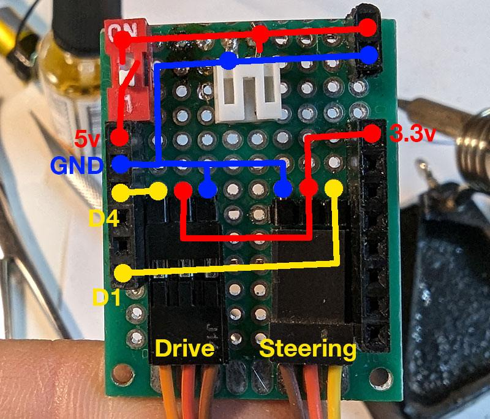

# Прошивка для машинок на esp8266 с управлением по MQTT. Веб-интерфейс для выбора машинки. 3д модели шасси.

Больше фотографий и информации на странице проекта: https://dev-and-ride.com/article/lego-mashini-s-ypravleniem-po-mqtt

    

    

    

    

    

    

